<p align="center">
  
</p>

<h1 align="center">ComposeBastion</h1>

<p align="center">
  A self-hosted control room for Docker hosts, Compose apps, recovery points,
  GitHub deploys, alerts, and day-two operations.
</p>

<p align="center">
  <a href="https://github.com/composebastion-admin/composebastion/releases"></a>
  <a href="https://github.com/composebastion-admin/composebastion/actions/workflows/ci.yml"></a>
  <a href="https://github.com/composebastion-admin/composebastion/pkgs/container/composebastion-app"></a>
  <a href="https://discord.gg/g25tEafYDX"></a>
  <a href="LICENSE.md"></a>
  
  
</p>

ComposeBastion gives you one private web console for operating multiple Docker
servers. Add hosts over SSH or the optional host agent, see what is running,
deploy Compose apps from GitHub, create recovery points, test restores, and keep
operators out of raw shell work for routine actions.

ComposeBastion can be installed either from published container images or from a
full source checkout. The published image path is the simplest option for NAS
devices, Proxmox Docker VMs/LXCs, Portainer stacks, and any native Docker host on
`linux/amd64` or `linux/arm64`.

## Published Release

Latest published stable release: `v1.1.2`.

- Package and OpenAPI version: `1.2.0-beta.1`.
- Current beta candidate: `v1.2.0-beta.1`.
- GitHub stable release images: `1.1.2` and `v1.1.2`.
- GitHub beta images: `beta` for both app and agent.
- Published platforms: `linux/amd64` and `linux/arm64` for both app and agent.
- Release gates include CI/OpenAPI, per-workspace coverage, separate
  mocked and live browser suites, the full dependency audit, Compose contracts,
  live-stack acceptance, and exact four-variant image scans.
- `main` publishes the moving `main` alias plus a full-commit
  `sha-<40-character-sha>` index. The `latest` alias moves only after an
  authorized stable `v*` tag passes the release rescans.

## Product Screenshots

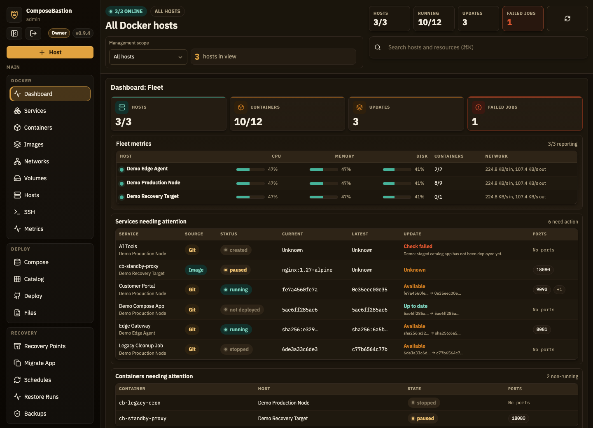

| Services and recovery | Containers and image cleanup |
|-----------------------|------------------------------|
| 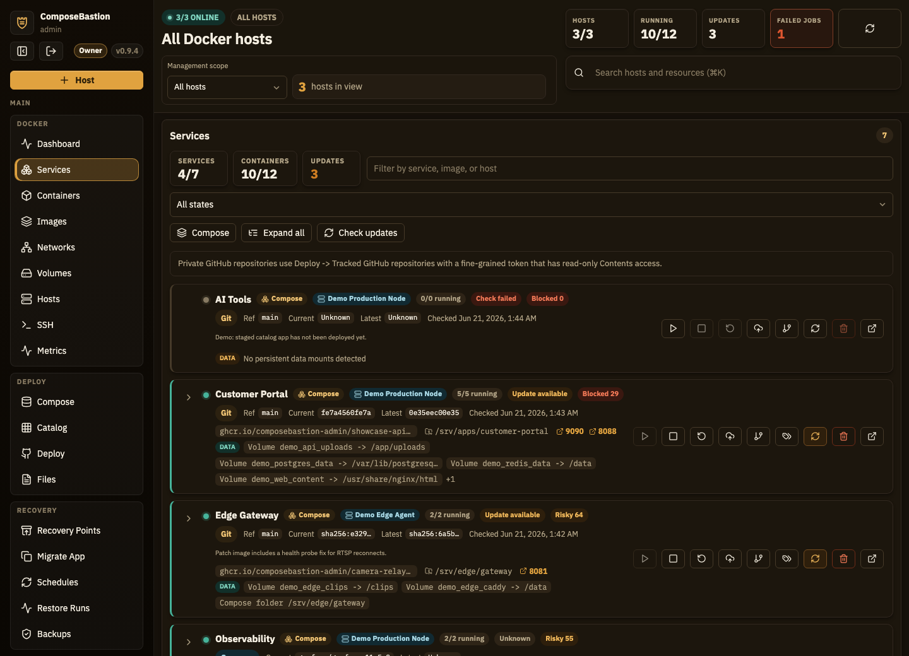 | 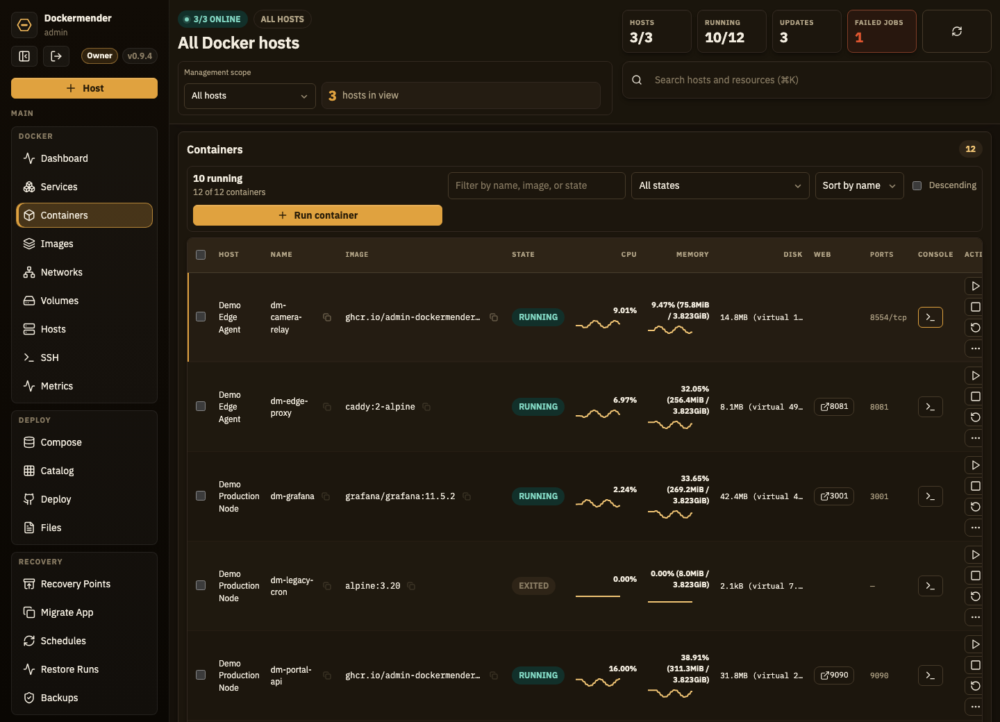 |
| 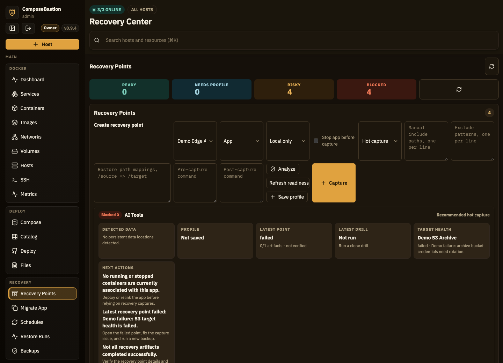 | 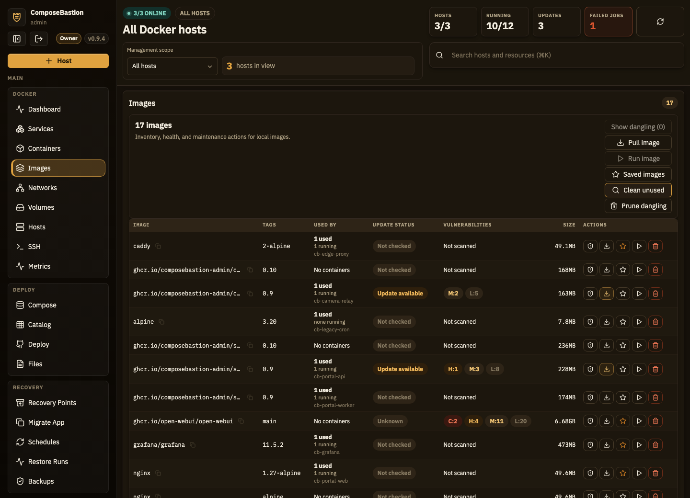 |

| Deploy and operations | Security and observability |
|-----------------------|----------------------------|
| 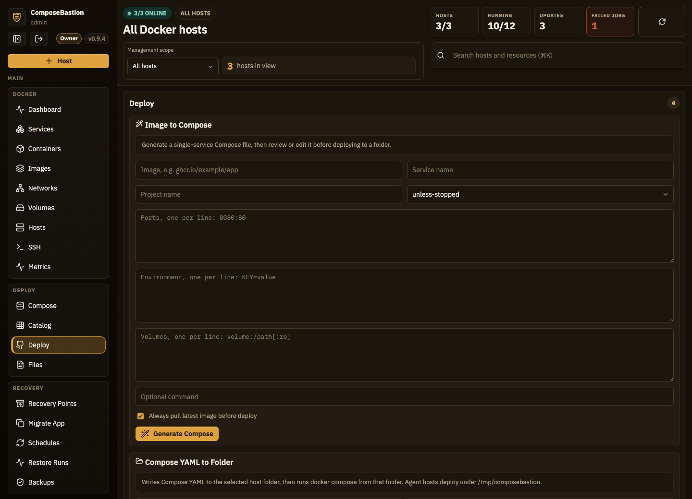 | 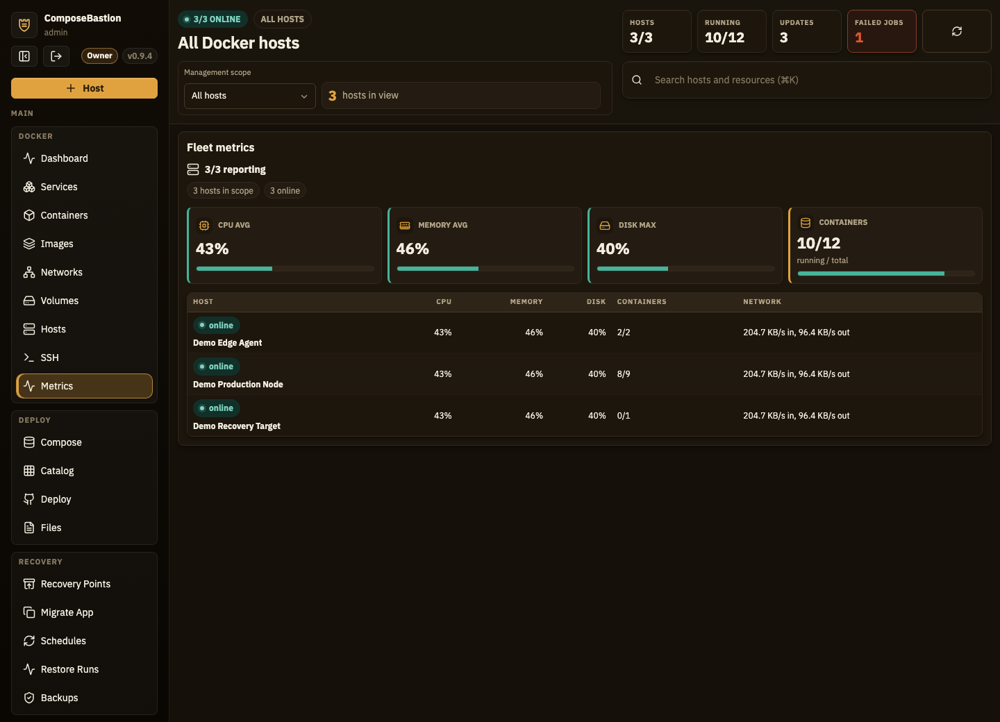 |
| 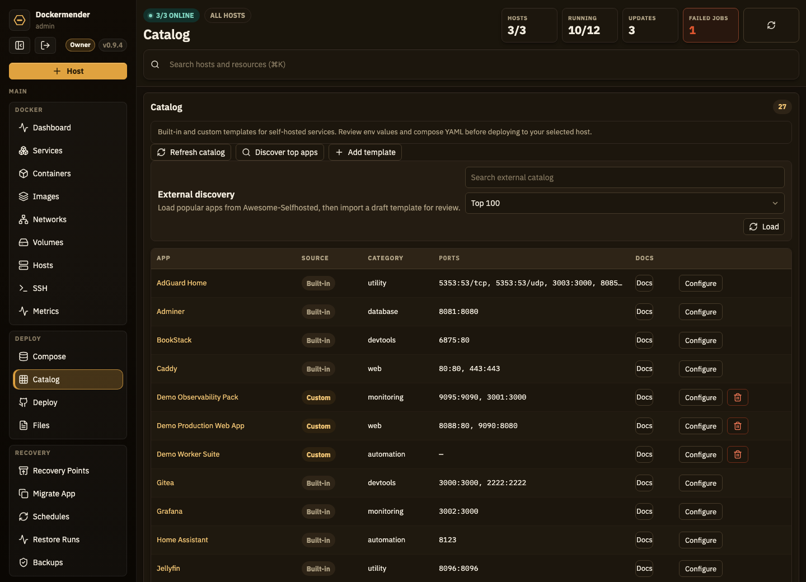 | 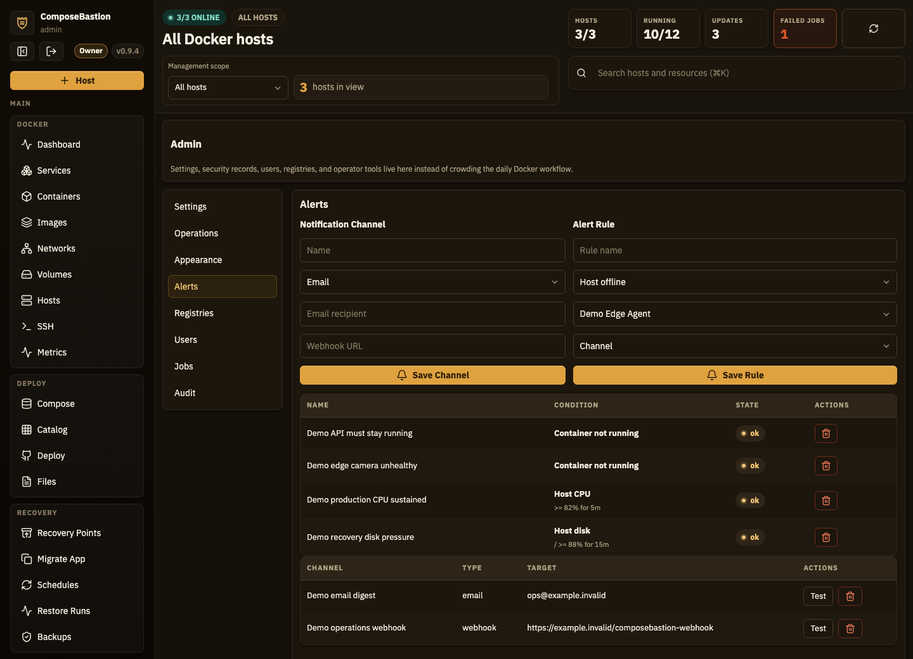 |

| Recovery workflows | Admin controls |
|--------------------|----------------|
| 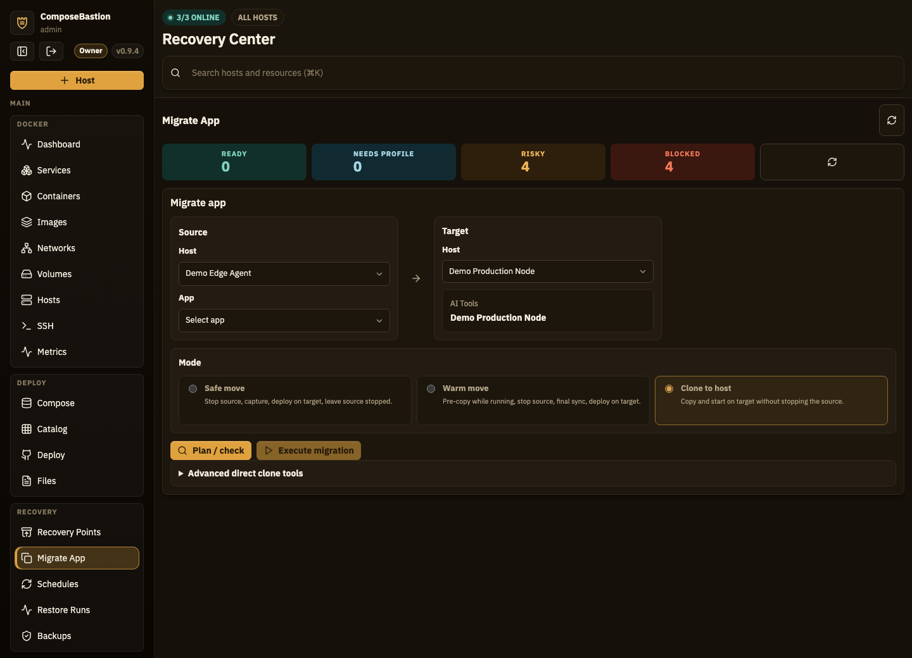 | 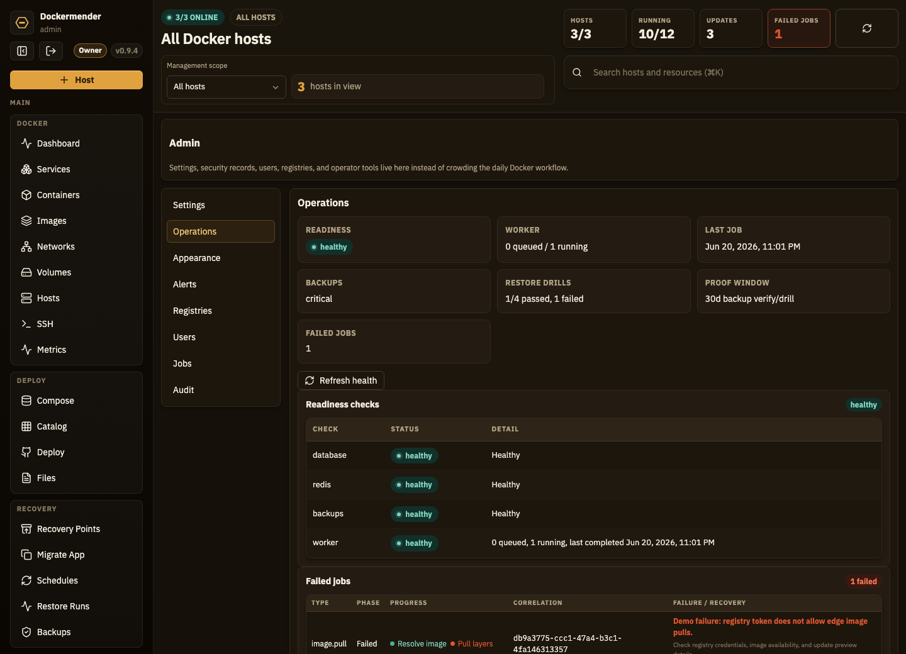 |
| 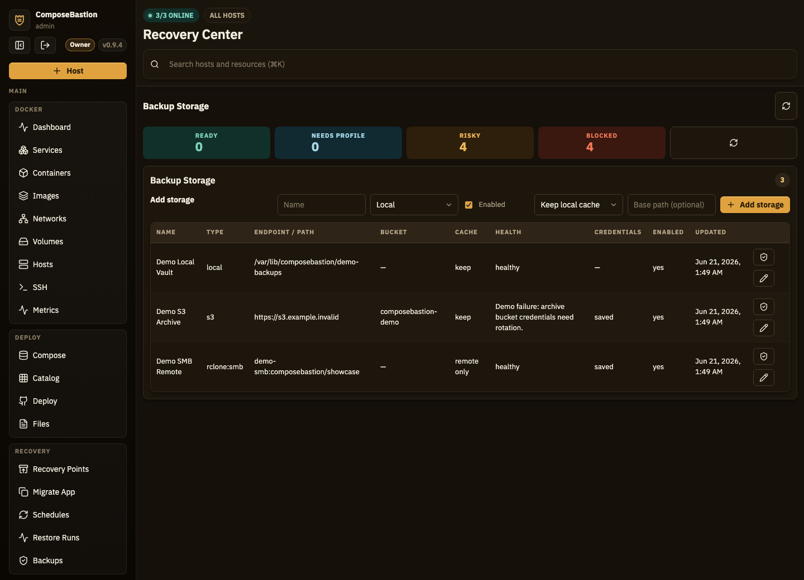 | 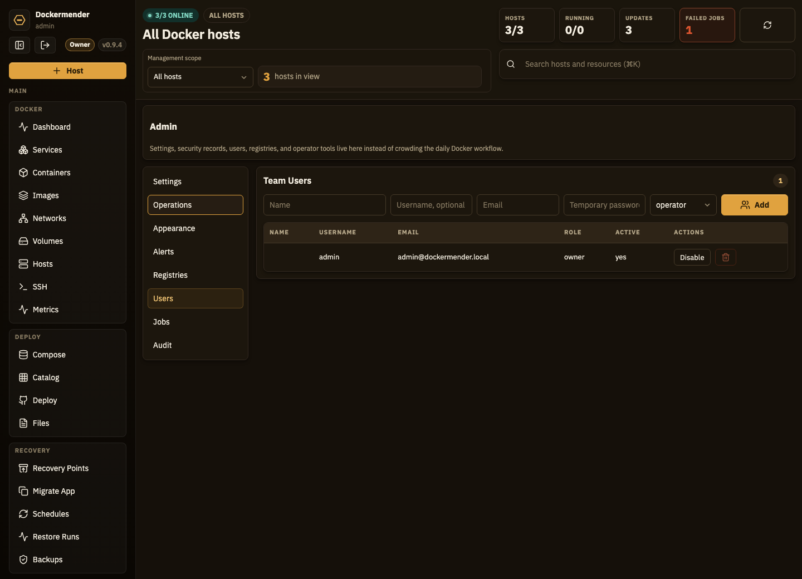 |

## Install In 5 Minutes

Prerequisites: Docker Engine, Docker Compose v2, and OpenSSL. Git is only needed
for the source-build install.

### Option A: Pull The Published Image

```bash
mkdir -p composebastion
cd composebastion
curl -fsSLO https://raw.githubusercontent.com/composebastion-admin/composebastion/main/docker-compose.image.yml
curl -fsSLO https://raw.githubusercontent.com/composebastion-admin/composebastion/main/.env.example
cp .env.example .env
```

Edit `.env` and set at least:

```bash
APP_SECRET=<unique random value from: openssl rand -base64 48>
POSTGRES_PASSWORD=<URL-safe database password from: openssl rand -hex 32>
# Leave DATABASE_URL blank for new Compose installations.
```

`SECURE_COOKIES=true` is the production default. `http://localhost:8080` works
for same-machine evaluation; if you must evaluate from another machine over a
trusted direct-HTTP network, explicitly set `SECURE_COOKIES=false` and restore
the secure default when HTTPS is configured. Never use that opt-out across an
untrusted network.

Start ComposeBastion:

```bash
docker compose -f docker-compose.image.yml pull
docker compose -f docker-compose.image.yml up -d
```

Open `http://localhost:8080`, create the first owner account, and choose
`Include demo workspace` if you want a ready-made showcase. The demo seeds
multiple hosts, Compose apps, GitHub deployments, alerts, backups, recovery
points, storage targets, image scans, migration runs, and catalog templates.
You can remove it later like any other demo data.

For production installs with a reverse proxy and persistent backup storage, use
the [installation guide](docs/installation.md).

Use the published image install for NAS devices, Proxmox Docker VMs/LXCs,
Portainer stacks, and home servers. Use the source build only when you are
developing ComposeBastion or intentionally customizing the checkout.
Normal users should update through a published `latest`, `beta`, version, or
immutable `sha-*` image; they should not check out `dev` and compile the
release toolchain on the server.

Published images:

- `ghcr.io/composebastion-admin/composebastion-app`
- `ghcr.io/composebastion-admin/composebastion-agent`

Image tags:

| Tag | Use |
|-----|-----|
| `latest` | Latest verified stable release for simple homelab/NAS updates. |
| `1.1.2` or `v1.1.2` | Exact V1 release pin for controlled production upgrades. |
| `main` | Latest fully scanned build from the protected main branch. |
| `beta` | Latest fully scanned beta candidate for app and agent testing. |
| `sha-*` | Immutable full-commit verification or rollback testing. |

Main and beta builds publish their branch alias and full-commit `sha-*` indexes
from the already scanned platform archives. Stable release tags rescan the
protected main indexes and then promote them to version tags such as `1.1.2`
and `v1.1.2`, the minor tag, and `latest`; they do not rebuild. See the
[beta testing notes](docs/beta-release.md) before using the beta channel.

### Option B: Build From Source

```bash
git clone https://github.com/composebastion-admin/composebastion.git
cd composebastion
cp .env.example .env
```

Set `APP_SECRET` and `POSTGRES_PASSWORD` in `.env`, then start:

```bash
docker compose up -d --build
```

## Update Commands

Disposable evaluation and homelab image installs can update from Admin ->
Operations -> ComposeBastion self-update. Choose the SSH host that runs the
ComposeBastion stack, save the Compose directory and Compose file, then start
the handoff. ComposeBastion writes a short host-side update script, pulls the
selected app and worker images, restarts them, and shows the latest handoff job
so you can confirm the update completed.

The release-qualified in-app path is `1.0.6/1.1.2/1.1.3 -> 1.1.4 -> 1.2`. Update to
the compatibility-only 1.1.4 bridge first; direct pre-1.2-to-1.2 updates are not
qualified. The bridge can retain the pre-1.2 `docker-compose.image.yml`, pull
and prepare the 1.2 candidate, and start only app/worker with dependency
recreation disabled. Manual image updates must download the matching
target-release Compose file so its initializer services and durable transition
receipt volume are available, and must use the target release's
`scripts/upgrade-image.sh` so those files are promoted only after verification.

In-app self-update currently accepts `latest` or a SemVer tag; it does not
consume a durable signed app/agent release-pair manifest. Production updates
must instead resolve one reviewed release revision, pin every participating
app and agent image to that revision's `sha-<40-character-sha>` index, and use
the manual procedure in the [upgrade guide](docs/upgrade-guide.md).

Manual image update fallback:

```bash
cd ~/composebastion
export REVIEWED_REVISION="REPLACE_WITH_REVIEWED_40_CHARACTER_COMMIT"
chmod 755 upgrade-image.target.sh
./upgrade-image.target.sh \
  --version "sha-${REVIEWED_REVISION}" \
  --compose docker-compose.image.yml docker-compose.image.target.yml
```

Source install:

```bash
cd ~/composebastion
git pull --ff-only
npm ci
npm run upgrade:source
```

## Why Operators Use It

| Need | ComposeBastion gives you |
|------|------------------------|
| Multi-host visibility | Containers, images, networks, volumes, Compose stacks, host metrics, and job history across all connected hosts. |
| Safer Docker actions | Typed jobs for start, stop, restart, remove, pull, prune, deploy, backup, restore, and migration workflows. |
| GitHub deploys | Track private or public GitHub Compose repositories with encrypted read-only tokens, branch discovery, preview, deploy, and redeploy. |
| Recovery confidence | Recovery points, storage targets, backup health attention, readiness scoring, restore drills, profiles, clone restores, and migration runs. |
| Team operations | Owner/admin/operator/viewer roles, active sessions, audit logs, request IDs, rate limits, and alert history. |
| Practical security | Encrypted secrets, origin checks, credentialed CORS controls, Docker-only agent endpoints, and viewer-safe inspect output. |

## Core Workflows

1. Add a Docker host over SSH or the host agent.
2. Review inventory in Services, Containers, Images, Networks, and Volumes.
3. Deploy or track Compose apps from GitHub.
4. Create recovery points and run clone-only restore drills.
5. Watch Admin -> Operations and Backup inventory for worker health, backup health attention, and failed jobs.
6. Add alert channels and metric thresholds for the services that matter.

## Product Demo Workspace

For screenshots, sales demos, or first-run evaluation, seed the demo workspace
during owner setup. It creates a full synthetic environment with online SSH and
agent hosts, a recovery target, stateful app stacks, source links, image update
intelligence, vulnerability scan summaries, alert history, backup schedules,
recovery drills, and migration examples. Demo hosts are tagged `demo` and use
simulated Docker actions, so you can click through workflows without needing
three real servers.

| GitHub deploy tracking | Catalog templates |
|------------------------|-------------------|
|  |  |

| Hosts and files | Images and updates |
|-----------------|--------------------|
| 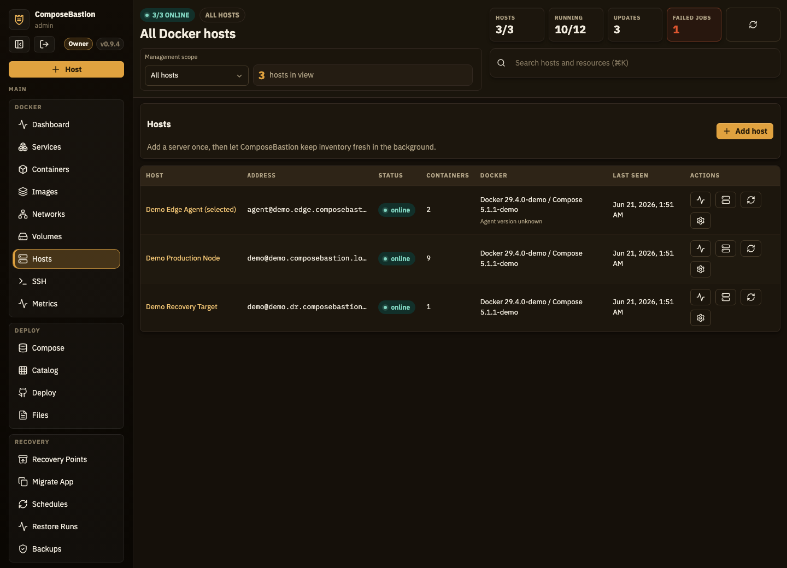 | 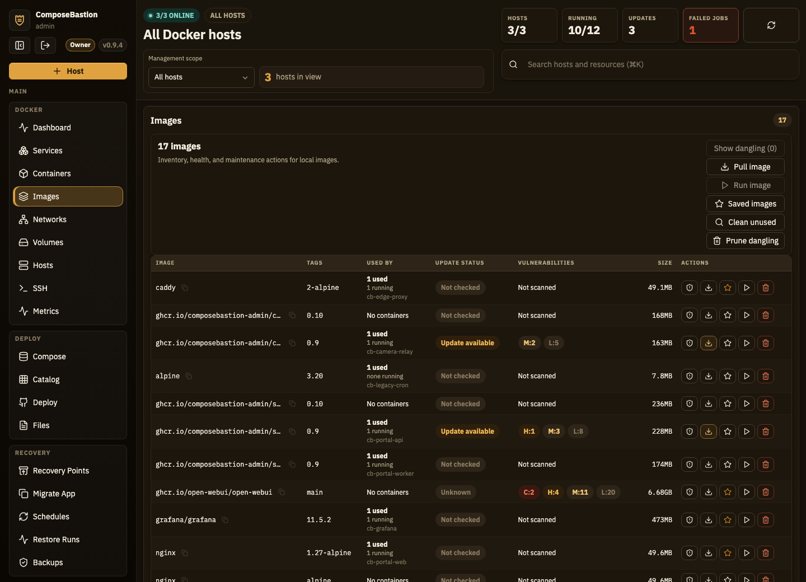 |
| 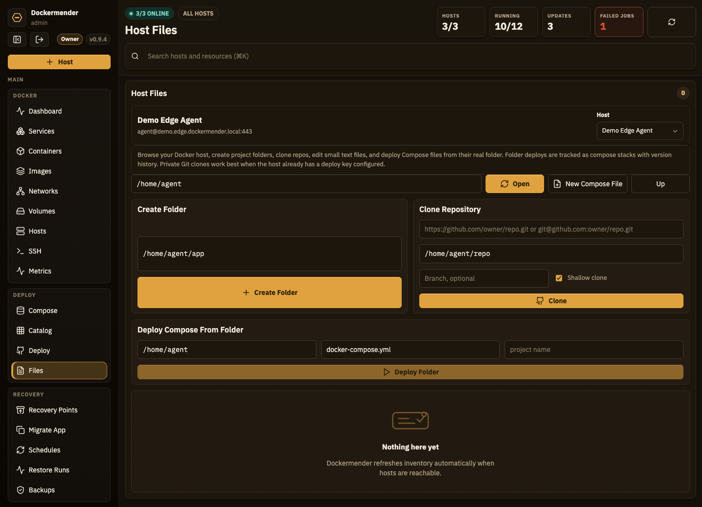 | 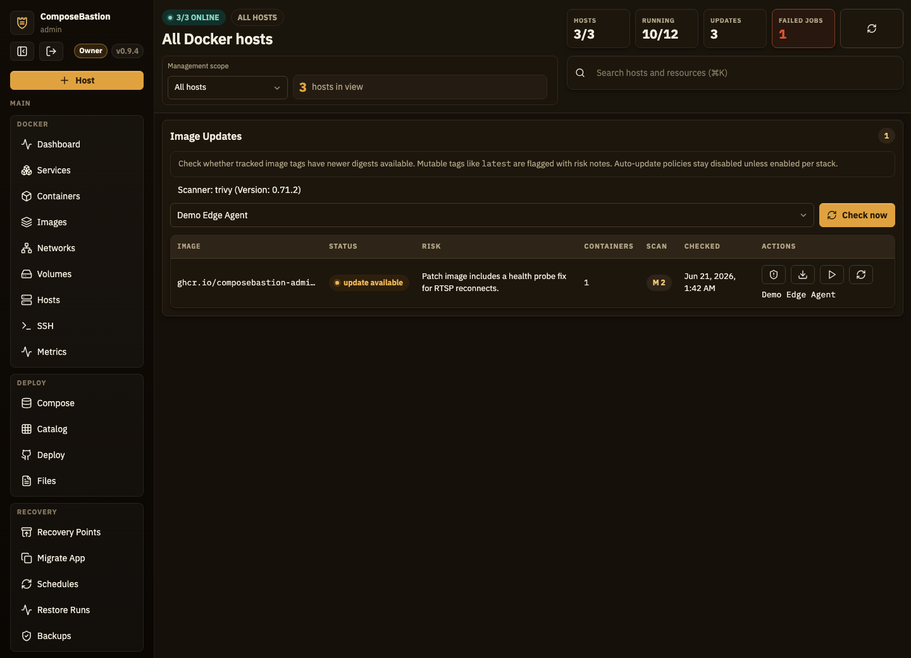 |

The full screenshot tour is in the [how-to guide](docs/how-to.md).

## Community

Join the [ComposeBastion Discord community](https://discord.gg/g25tEafYDX) for
project discussion, questions, and updates.

## Guides

- [Installation and production setup](docs/installation.md)
- [Connect Docker hosts](docs/connect-hosts.md)
- [Deploy Compose apps from GitHub](docs/deploy-from-github.md)
- [Recovery, backups, and restore drills](docs/recovery-guide.md)
- [Daily operations runbook](docs/operations-runbook.md)
- [Security hardening checklist](docs/security-hardening.md)
- [Opt-in container hardening](docs/container-hardening.md)
- [API contract notes](docs/api-contracts.md)
- [OpenAPI summary](docs/openapi.md)

## Production Checklist

- Use a unique `APP_SECRET` and a URL-safe `POSTGRES_PASSWORD`.
- Mount recovery storage outside the container, for example
  `/srv/composebastion/backups`.
- Put ComposeBastion behind HTTPS and keep the production `SECURE_COOKIES=true`
  default; use `false` only for a trusted, direct-HTTP evaluation.
- Set `CORS_ORIGINS` when the UI and API are served from different origins.
- Restrict agent port `8090` to the manager network.
- The manager runs as UID/GID `1000:1000`; pre-create bind-mounted backup
  storage with that ownership. Consider the optional read-only/capability
  hardening overlay after preparing backup and scanner-cache ownership.
- Configure `BACKUP_HOST_PATH_ALLOWED_ROOTS` for production host-path recovery.
- Test at least one recovery point, verify, and clone restore drill before
  relying on a backup target.

## What Ships In V1

- Multi-host Docker inventory and management.
- SSH and optional host-agent connection modes.
- Compose deploys, GitHub repository tracking, branch checks, and redeploy jobs.
- Recovery points, recovery profiles, storage targets, backup health attention,
  restore drills, readiness scoring, and migration workflows.
- Host metrics, host metric alerts, email/webhook notifications, alert silences,
  and alert history.
- RBAC, active session management, audit events, route rate limits, request IDs,
  generated OpenAPI docs, and CI gates.
- Image-only install files and published GHCR images for NAS devices, Proxmox
  Docker guests, Portainer stacks, and native Docker hosts on `linux/amd64` or
  `linux/arm64`.
- Config backup/restore for hosts, tracked repos, registries, alerts, users,
  Compose stacks, recovery schedules, storage targets, and operator settings.
- Runtime image license and notice files are available under `/licenses`.
- V1 release verification guidance is in [docs/v1-readiness.md](docs/v1-readiness.md).

## License

ComposeBastion is source-available, not open source. Free use is allowed for home
labs, home use, private use, personal learning, and private non-commercial
testing.

Business, company, employer, client, customer, MSP, SaaS, hosted, government,
school, nonprofit, production, non-production, testing, staging,
proof-of-concept, evaluation, or organizational use requires prior written
approval or a purchased license.

Public forks, mirrors, republished copies, public derivative projects, package
republishing, and container image republishing require prior written approval or
a purchased license.

See [LICENSE.md](LICENSE.md), [LICENSING_SUMMARY.md](LICENSING_SUMMARY.md), and
[COMMERCIAL-LICENSE.md](COMMERCIAL-LICENSE.md). Third-party dependency notices
are listed in [THIRD-PARTY-NOTICES.md](THIRD-PARTY-NOTICES.md). Commercial
licensing and written permission requests go to `support@composebastion.com`.

## Development

Source development and release checks require Node.js 24 and npm 11.19 or
newer within npm 11. Dependency install scripts are denied by default; the
reviewed, version-pinned exceptions are recorded in `package.json`.

```bash
npm ci
npm run typecheck
npm test
npm run smoke:web
```

Useful checks:

```bash
npm run lint:migrations
npm run openapi:check
npm audit --audit-level=high
```
